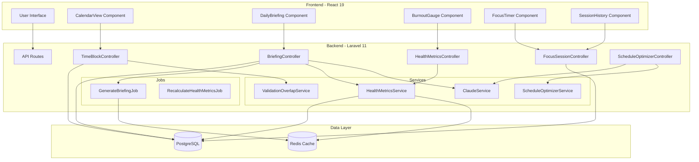

# Design Document: ORVYN Phase 3 Enhancements

## Overview

Phase 3 enhances ORVYN with advanced time management, AI-driven insights, and burnout prevention features. Building on the existing Laravel 11 backend and React 19 frontend, this phase introduces:

- **Visual Calendar Management**: Drag-and-drop time block scheduling with daily/weekly views
- **AI Daily Briefings**: Morning summaries analyzing workload, priorities, and health metrics
- **Burnout Monitoring**: Real-time risk calculation with visual gauge indicators
- **Focus Timer**: Pomodoro-style timer with task integration and session tracking
- **Schedule Optimization**: AI-powered suggestions for optimal time allocation

The design maintains consistency with existing architecture patterns while introducing new services, controllers, and frontend components. All features support graceful degradation when AI services are unavailable.

## Architecture

### System Architecture



### Layer Responsibilities

**Frontend Layer (React 19)**
- Renders visual calendar with time blocks
- Handles drag-and-drop interactions with validation feedback
- Displays AI briefings and health metrics with glassmorphism styling
- Manages focus timer countdown and session state
- Provides responsive layouts for mobile, tablet, desktop

**API Layer (Laravel Controllers)**
- Validates incoming requests with Laravel validation rules
- Enforces authentication via Sanctum middleware
- Coordinates service calls and returns JSON responses
- Handles error responses with appropriate HTTP status codes

**Service Layer**
- **ClaudeService**: AI briefing generation with fallback logic
- **ScheduleOptimizerService**: Time block suggestions based on task analysis
- **HealthMetricsService**: Burnout risk and stress level calculations
- **ValidationOverlapService**: Time block conflict detection

**Job Layer (Queue Workers)**
- **GenerateBriefingJob**: Async briefing generation with caching
- **RecalculateHealthMetricsJob**: Triggered on task changes

**Data Layer**
- **PostgreSQL**: Persistent storage for tasks, time blocks, briefings, sessions
- **Redis**: Cache for briefings (24h TTL), health metrics (1h TTL), session data

## Components and Interfaces

### Backend Components

#### Controllers

**TimeBlockController**
```php
class TimeBlockController extends Controller
{
    public function __construct(
        private ValidationOverlapService $overlapService
    ) {}
    
    // GET /api/time-blocks?start_date=2024-01-01&end_date=2024-01-07
    public function index(Request $request): JsonResponse
    
    // POST /api/time-blocks
    public function store(Request $request): JsonResponse
    
    // PUT /api/time-blocks/{id}
    public function update(Request $request, TimeBlock $timeBlock): JsonResponse
    
    // DELETE /api/time-blocks/{id}
    public function destroy(TimeBlock $timeBlock): JsonResponse
}
```

**BriefingController**
```php
class BriefingController extends Controller
{
    public function __construct(
        private ClaudeService $claudeService,
        private HealthMetricsService $healthMetricsService
    ) {}
    
    // GET /api/briefings/today
    public function today(): JsonResponse
    
    // POST /api/briefings/generate
    public function generate(Request $request): JsonResponse
}
```

**HealthMetricsController**
```php
class HealthMetricsController extends Controller
{
    public function __construct(
        private HealthMetricsService $healthMetricsService
    ) {}
    
    // GET /api/health-metrics
    public function index(): JsonResponse
}
```

**FocusSessionController**
```php
class FocusSessionController extends Controller
{
    // GET /api/focus-sessions?start_date=2024-01-01&task_id=uuid
    public function index(Request $request): JsonResponse
    
    // POST /api/focus-sessions
    public function store(Request $request): JsonResponse
}
```

**ScheduleOptimizerController**
```php
class ScheduleOptimizerController extends Controller
{
    public function __construct(
        private ScheduleOptimizerService $optimizerService
    ) {}
    
    // POST /api/schedule/optimize
    public function optimize(Request $request): JsonResponse
}
```

#### Services

**HealthMetricsService**
```php
class HealthMetricsService
{
    public function calculateMetrics(User $user): array
    {
        // Returns: ['burnout_risk' => 'low|medium|high', 
        //           'stress_level' => 1-10, 
        //           'workload_balance' => 'underloaded|balanced|overloaded']
    }
    
    public function getBurnoutRisk(int $activeTasks, int $overdueTasks): string
    
    public function getStressLevel(int $activeTasks, int $overdueTasks, float $avgDifficulty): float
    
    public function getWorkloadBalance(int $activeTasks): string
}
```

**ValidationOverlapService**
```php
class ValidationOverlapService
{
    public function hasOverlap(
        User $user, 
        Carbon $startTime, 
        Carbon $endTime, 
        ?string $excludeBlockId = null
    ): bool
    
    public function getConflictingBlocks(
        User $user, 
        Carbon $startTime, 
        Carbon $endTime
    ): Collection
}
```

**ScheduleOptimizerService**
```php
class ScheduleOptimizerService
{
    public function __construct(
        private ClaudeService $claudeService
    ) {}
    
    public function generateSuggestions(User $user, Carbon $date): array
    {
        // Returns array of suggested time blocks with reasoning
        // [
        //   {
        //     'task_id' => 'uuid',
        //     'start_time' => '2024-01-01 09:00:00',
        //     'end_time' => '2024-01-01 10:30:00',
        //     'reasoning' => 'High priority task with approaching deadline'
        //   }
        // ]
    }
    
    private function analyzeTaskPriorities(Collection $tasks): array
    
    private function findAvailableSlots(User $user, Carbon $date): array
    
    private function fallbackOptimization(Collection $tasks, array $availableSlots): array
}
```

#### Jobs

**GenerateBriefingJob**
```php
class GenerateBriefingJob implements ShouldQueue
{
    use Dispatchable, InteractsWithQueue, Queueable, SerializesModels;
    
    public function __construct(
        private User $user,
        private Carbon $date
    ) {}
    
    public function handle(
        ClaudeService $claudeService,
        HealthMetricsService $healthMetricsService
    ): void
    {
        // Generate briefing, cache in Redis, persist to database
    }
}
```

**RecalculateHealthMetricsJob**
```php
class RecalculateHealthMetricsJob implements ShouldQueue
{
    use Dispatchable, InteractsWithQueue, Queueable, SerializesModels;
    
    public function __construct(
        private User $user
    ) {}
    
    public function handle(HealthMetricsService $healthMetricsService): void
    {
        // Recalculate metrics, update cache
    }
}
```

### Frontend Components

#### CalendarView Component
```typescript
interface CalendarViewProps {
  mode: 'daily' | 'weekly';
  selectedDate: Date;
  onDateChange: (date: Date) => void;
}

const CalendarView: React.FC<CalendarViewProps> = ({ mode, selectedDate, onDateChange }) => {
  // Fetches time blocks for date range
  // Renders TimeBlockCard components
  // Handles drag-and-drop with react-dnd or framer-motion
  // Shows current time marker
  // Displays time labels (00:00 - 23:59)
}
```

#### TimeBlockCard Component
```typescript
interface TimeBlockCardProps {
  block: TimeBlock;
  onUpdate: (id: string, updates: Partial<TimeBlock>) => Promise<void>;
  onDelete: (id: string) => Promise<void>;
  isDragging?: boolean;
}

const TimeBlockCard: React.FC<TimeBlockCardProps> = ({ block, onUpdate, onDelete, isDragging }) => {
  // Renders block with glassmorphism styling
  // Shows label, time range, task title (if associated)
  // Displays block type icon and color
  // Handles drag events
  // Shows lock icon if is_locked
}
```

#### DailyBriefing Component
```typescript
interface DailyBriefingProps {
  onRefresh?: () => void;
}

const DailyBriefing: React.FC<DailyBriefingProps> = ({ onRefresh }) => {
  // Fetches today's briefing from API
  // Displays summary with glassmorphism card
  // Renders health metrics with visual indicators
  // Shows recommended adjustments as actionable list
  // Displays loading skeleton while fetching
  // Shows degraded mode notice if AI unavailable
}
```

#### BurnoutGauge Component
```typescript
interface BurnoutGaugeProps {
  metrics: HealthMetrics;
  size?: 'small' | 'medium' | 'large';
}

const BurnoutGauge: React.FC<BurnoutGaugeProps> = ({ metrics, size = 'medium' }) => {
  // Renders radial gauge with color coding
  // Green (low), Yellow (medium), Red (high)
  // Displays numeric stress level (1-10)
  // Shows warning text for high burnout risk
  // Updates in real-time via polling or websockets
  // Applies glassmorphism styling
}
```

#### FocusTimer Component
```typescript
interface FocusTimerProps {
  onSessionComplete?: (session: FocusSession) => void;
}

const FocusTimer: React.FC<FocusTimerProps> = ({ onSessionComplete }) => {
  // Manages timer state (25min work, 5min short break, 15min long break)
  // Displays countdown in MM:SS format
  // Shows task selector for associating session
  // Provides start, pause, skip controls
  // Plays notification sound on completion
  // Tracks session count toward long break (1-4 indicator)
  // Persists completed sessions to API
}
```

#### SessionHistory Component
```typescript
interface SessionHistoryProps {
  taskId?: string;
  startDate?: Date;
  endDate?: Date;
}

const SessionHistory: React.FC<SessionHistoryProps> = ({ taskId, startDate, endDate }) => {
  // Fetches session history with filters
  // Displays sessions with date, task, duration
  // Shows daily/weekly totals
  // Implements pagination (50 records per page)
  // Applies glassmorphism styling
}
```

## Data Models

### Database Schema Additions

**focus_sessions table** (NEW)
```sql
CREATE TABLE focus_sessions (
    id UUID PRIMARY KEY,
    user_id UUID NOT NULL REFERENCES users(id) ON DELETE CASCADE,
    task_id UUID NULL REFERENCES tasks(id) ON DELETE SET NULL,
    start_time TIMESTAMP NOT NULL,
    end_time TIMESTAMP NOT NULL,
    session_type VARCHAR(20) NOT NULL, -- 'work', 'short_break', 'long_break'
    created_at TIMESTAMP NOT NULL,
    updated_at TIMESTAMP NOT NULL,
    
    INDEX idx_focus_sessions_user_date (user_id, start_time),
    INDEX idx_focus_sessions_task (task_id)
);
```

**Existing Tables** (No changes required)
- `tasks`: Already has all required fields
- `time_blocks`: Already has all required fields including block_type enum
- `ai_briefings`: Already has health_metrics and recommended_adjustments JSON fields
- `users`: No changes needed

### TypeScript Interfaces

**TimeBlock**
```typescript
export type BlockType = 'deep_work' | 'lecture' | 'sleep' | 'break' | 'routine';

export interface TimeBlock {
  id: string;
  user_id: string;
  task_id: string | null;
  label: string;
  start_time: string; // ISO 8601
  end_time: string; // ISO 8601
  is_locked: boolean;
  block_type: BlockType;
  created_at: string;
  updated_at: string;
  task?: Task; // Eager loaded relation
}
```

**AIBriefing**
```typescript
export interface HealthMetrics {
  burnout_risk: 'low' | 'medium' | 'high';
  workload_balance: 'underloaded' | 'balanced' | 'overloaded';
  stress_level: number; // 1-10
}

export interface AIBriefing {
  id: string;
  user_id: string;
  briefing_date: string; // YYYY-MM-DD
  summary_content: string;
  health_metrics: HealthMetrics;
  recommended_adjustments: string[];
  created_at: string;
  updated_at: string;
}
```

**FocusSession**
```typescript
export type SessionType = 'work' | 'short_break' | 'long_break';

export interface FocusSession {
  id: string;
  user_id: string;
  task_id: string | null;
  start_time: string; // ISO 8601
  end_time: string; // ISO 8601
  session_type: SessionType;
  created_at: string;
  updated_at: string;
  task?: Task; // Eager loaded relation
}
```

**ScheduleSuggestion**
```typescript
export interface ScheduleSuggestion {
  task_id: string;
  task_title: string;
  start_time: string; // ISO 8601
  end_time: string; // ISO 8601
  reasoning: string;
  priority: TaskPriority;
  deadline: string | null;
}
```

### API Request/Response Formats

**POST /api/time-blocks**
```json
Request:
{
  "label": "Study Session",
  "start_time": "2024-01-15T09:00:00Z",
  "end_time": "2024-01-15T11:00:00Z",
  "block_type": "deep_work",
  "task_id": "uuid-here",
  "is_locked": false
}

Response (201):
{
  "data": {
    "id": "uuid",
    "user_id": "uuid",
    "task_id": "uuid",
    "label": "Study Session",
    "start_time": "2024-01-15T09:00:00Z",
    "end_time": "2024-01-15T11:00:00Z",
    "block_type": "deep_work",
    "is_locked": false,
    "created_at": "2024-01-15T08:00:00Z",
    "updated_at": "2024-01-15T08:00:00Z",
    "task": { /* task object */ }
  },
  "message": "Time block created successfully"
}

Error (400):
{
  "message": "Validation failed",
  "errors": {
    "start_time": ["Start time must be before end time"],
    "overlap": ["Time block overlaps with existing block: Lecture (09:30-10:30)"]
  }
}
```

**GET /api/briefings/today**
```json
Response (200):
{
  "data": {
    "id": "uuid",
    "user_id": "uuid",
    "briefing_date": "2024-01-15",
    "summary_content": "You have 8 active tasks with 2 approaching deadlines. Focus on completing the Math assignment due tomorrow.",
    "health_metrics": {
      "burnout_risk": "medium",
      "workload_balance": "balanced",
      "stress_level": 6.5
    },
    "recommended_adjustments": [
      "Prioritize tasks with deadlines within 48 hours",
      "Schedule a 15-minute break between deep work sessions"
    ],
    "created_at": "2024-01-15T06:00:00Z",
    "updated_at": "2024-01-15T06:00:00Z"
  },
  "message": "Briefing retrieved successfully",
  "cached": true,
  "degraded_mode": false
}
```

**POST /api/schedule/optimize**
```json
Request:
{
  "date": "2024-01-15"
}

Response (200):
{
  "data": {
    "suggestions": [
      {
        "task_id": "uuid-1",
        "task_title": "Math Assignment",
        "start_time": "2024-01-15T09:00:00Z",
        "end_time": "2024-01-15T11:00:00Z",
        "reasoning": "High priority task with deadline tomorrow. Scheduled during morning hours for optimal focus.",
        "priority": "high",
        "deadline": "2024-01-16T23:59:59Z"
      },
      {
        "task_id": "uuid-2",
        "task_title": "Read Chapter 5",
        "start_time": "2024-01-15T14:00:00Z",
        "end_time": "2024-01-15T15:30:00Z",
        "reasoning": "Medium difficulty task scheduled after lunch break.",
        "priority": "medium",
        "deadline": "2024-01-20T23:59:59Z"
      }
    ],
    "available_slots": [
      {"start": "2024-01-15T09:00:00Z", "end": "2024-01-15T12:00:00Z"},
      {"start": "2024-01-15T14:00:00Z", "end": "2024-01-15T18:00:00Z"}
    ]
  },
  "message": "Schedule optimization completed",
  "ai_powered": true
}
```

**POST /api/focus-sessions**
```json
Request:
{
  "task_id": "uuid",
  "start_time": "2024-01-15T09:00:00Z",
  "end_time": "2024-01-15T09:25:00Z",
  "session_type": "work"
}

Response (201):
{
  "data": {
    "id": "uuid",
    "user_id": "uuid",
    "task_id": "uuid",
    "start_time": "2024-01-15T09:00:00Z",
    "end_time": "2024-01-15T09:25:00Z",
    "session_type": "work",
    "created_at": "2024-01-15T09:25:00Z",
    "updated_at": "2024-01-15T09:25:00Z",
    "task": { /* task object */ }
  },
  "message": "Focus session recorded successfully"
}
```

## Algorithms and Business Logic

### Burnout Risk Calculation Algorithm

```typescript
function calculateBurnoutRisk(
  activeTasks: number,
  overdueTasks: number
): 'low' | 'medium' | 'high' {
  // High risk conditions
  if (activeTasks > 15 || overdueTasks > 5) {
    return 'high';
  }
  
  // Medium risk conditions
  if (activeTasks > 10 || overdueTasks > 2) {
    return 'medium';
  }
  
  // Low risk (default)
  return 'low';
}

function calculateStressLevel(
  activeTasks: number,
  overdueTasks: number,
  avgDifficulty: number
): number {
  const stressLevel = (activeTasks * 0.5) + (overdueTasks * 1.5) + (avgDifficulty * 0.5);
  return Math.min(10, Math.round(stressLevel * 10) / 10);
}

function calculateWorkloadBalance(activeTasks: number): string {
  if (activeTasks > 12) return 'overloaded';
  if (activeTasks < 3) return 'underloaded';
  return 'balanced';
}
```

### Time Block Overlap Detection Algorithm

```typescript
function hasOverlap(
  newBlock: { start: Date; end: Date },
  existingBlocks: TimeBlock[],
  excludeBlockId?: string
): boolean {
  const newStart = newBlock.start.getTime();
  const newEnd = newBlock.end.getTime();
  
  for (const block of existingBlocks) {
    // Skip if this is the block being updated
    if (excludeBlockId && block.id === excludeBlockId) continue;
    
    // Skip routine blocks (they can overlap)
    if (block.block_type === 'routine') continue;
    
    const blockStart = new Date(block.start_time).getTime();
    const blockEnd = new Date(block.end_time).getTime();
    
    // Check for overlap: (StartA < EndB) AND (EndA > StartB)
    if (newStart < blockEnd && newEnd > blockStart) {
      return true;
    }
  }
  
  return false;
}

function getConflictingBlocks(
  newBlock: { start: Date; end: Date },
  existingBlocks: TimeBlock[]
): TimeBlock[] {
  const conflicts: TimeBlock[] = [];
  const newStart = newBlock.start.getTime();
  const newEnd = newBlock.end.getTime();
  
  for (const block of existingBlocks) {
    if (block.block_type === 'routine') continue;
    
    const blockStart = new Date(block.start_time).getTime();
    const blockEnd = new Date(block.end_time).getTime();
    
    if (newStart < blockEnd && newEnd > blockStart) {
      conflicts.push(block);
    }
  }
  
  return conflicts;
}
```

### Schedule Optimization Algorithm

```typescript
interface OptimizationContext {
  tasks: Task[];
  existingBlocks: TimeBlock[];
  date: Date;
  workingHours: { start: number; end: number }; // e.g., { start: 8, end: 22 }
}

function optimizeSchedule(context: OptimizationContext): ScheduleSuggestion[] {
  const { tasks, existingBlocks, date, workingHours } = context;
  
  // Step 1: Score and sort tasks by priority
  const scoredTasks = tasks
    .filter(task => task.status === 'todo' || task.status === 'in_progress')
    .map(task => ({
      task,
      score: calculateTaskScore(task)
    }))
    .sort((a, b) => b.score - a.score);
  
  // Step 2: Find available time slots
  const availableSlots = findAvailableSlots(existingBlocks, date, workingHours);
  
  // Step 3: Allocate tasks to slots
  const suggestions: ScheduleSuggestion[] = [];
  
  for (const { task, score } of scoredTasks) {
    const durationHours = task.duration_minutes / 60;
    
    // Find a slot that fits this task
    for (let i = 0; i < availableSlots.length; i++) {
      const slot = availableSlots[i];
      const slotDuration = (slot.end.getTime() - slot.start.getTime()) / (1000 * 60 * 60);
      
      if (slotDuration >= durationHours) {
        const startTime = slot.start;
        const endTime = new Date(slot.start.getTime() + task.duration_minutes * 60 * 1000);
        
        suggestions.push({
          task_id: task.id,
          task_title: task.title,
          start_time: startTime.toISOString(),
          end_time: endTime.toISOString(),
          reasoning: generateReasoning(task, score),
          priority: task.priority,
          deadline: task.deadline
        });
        
        // Update the slot (split or remove)
        if (slotDuration > durationHours) {
          availableSlots[i] = {
            start: endTime,
            end: slot.end
          };
        } else {
          availableSlots.splice(i, 1);
        }
        
        break;
      }
    }
    
    // Stop if we've filled enough slots or have 5 suggestions
    if (suggestions.length >= 5 || availableSlots.length === 0) break;
  }
  
  return suggestions;
}

function calculateTaskScore(task: Task): number {
  let score = 0;
  
  // Priority weight (0-40 points)
  const priorityScores = { low: 10, medium: 20, high: 30, critical: 40 };
  score += priorityScores[task.priority] || 20;
  
  // Deadline urgency (0-40 points)
  if (task.deadline) {
    const hoursUntilDeadline = (new Date(task.deadline).getTime() - Date.now()) / (1000 * 60 * 60);
    if (hoursUntilDeadline <= 48) score += 40;
    else if (hoursUntilDeadline <= 168) score += 20; // 1 week
    else score += 10;
  }
  
  // Difficulty weight (0-20 points) - harder tasks get higher priority
  score += (task.difficulty || 3) * 4;
  
  return score;
}

function findAvailableSlots(
  existingBlocks: TimeBlock[],
  date: Date,
  workingHours: { start: number; end: number }
): Array<{ start: Date; end: Date }> {
  const dayStart = new Date(date);
  dayStart.setHours(workingHours.start, 0, 0, 0);
  
  const dayEnd = new Date(date);
  dayEnd.setHours(workingHours.end, 0, 0, 0);
  
  // Sort existing blocks by start time
  const sortedBlocks = existingBlocks
    .filter(block => {
      const blockDate = new Date(block.start_time);
      return blockDate.toDateString() === date.toDateString();
    })
    .sort((a, b) => new Date(a.start_time).getTime() - new Date(b.start_time).getTime());
  
  const slots: Array<{ start: Date; end: Date }> = [];
  let currentTime = dayStart;
  
  for (const block of sortedBlocks) {
    const blockStart = new Date(block.start_time);
    const blockEnd = new Date(block.end_time);
    
    // If there's a gap before this block, add it as a slot
    if (currentTime < blockStart) {
      slots.push({ start: currentTime, end: blockStart });
    }
    
    // Move current time to end of this block
    currentTime = blockEnd > currentTime ? blockEnd : currentTime;
  }
  
  // Add final slot if there's time remaining
  if (currentTime < dayEnd) {
    slots.push({ start: currentTime, end: dayEnd });
  }
  
  return slots;
}

function generateReasoning(task: Task, score: number): string {
  const reasons: string[] = [];
  
  if (task.priority === 'critical' || task.priority === 'high') {
    reasons.push(`${task.priority} priority task`);
  }
  
  if (task.deadline) {
    const hoursUntilDeadline = (new Date(task.deadline).getTime() - Date.now()) / (1000 * 60 * 60);
    if (hoursUntilDeadline <= 48) {
      reasons.push('deadline within 48 hours');
    } else if (hoursUntilDeadline <= 168) {
      reasons.push('deadline within 1 week');
    }
  }
  
  if (task.difficulty && task.difficulty >= 4) {
    reasons.push('high difficulty task requiring focused time');
  }
  
  if (reasons.length === 0) {
    return 'Scheduled based on task priority and available time slots';
  }
  
  return reasons.join(', ') + '. Scheduled during optimal focus hours.';
}
```
